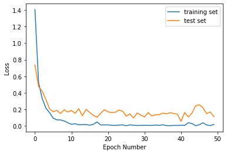
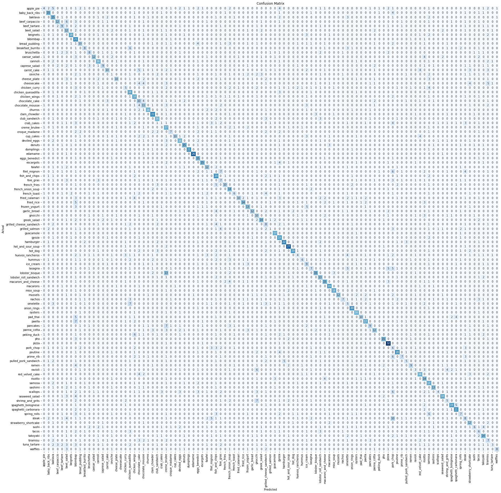

### Inception v3


```python
import numpy as np
import pandas as pd
from pathlib import Path
import os.path

import matplotlib.pyplot as plt
import seaborn as sns

from sklearn.model_selection import train_test_split
from tensorflow.keras.preprocessing import image
import tensorflow as tf

from tensorflow.keras.applications.resnet50 import preprocess_input, decode_predictions
from tensorflow.keras.preprocessing import image
from tensorflow.keras.models import Model
from tensorflow.keras.optimizers import Adam
from tensorflow.keras.optimizers import RMSprop


from tensorflow.keras.applications.inception_v3 import InceptionV3
from tensorflow.keras.applications.vgg16 import VGG16
from tensorflow.keras.applications import ResNet50
from tensorflow.keras.layers import Dense, Dropout, BatchNormalization
from sklearn.metrics import confusion_matrix, classification_report
import time
```

    Init Plugin
    Init Graph Optimizer
    Init Kernel


```python
image_dir = Path(r'/Users/rafay/Documents/FYP/abc')
```


```python
filepaths = list(image_dir.glob(r'**/*.jpg'))
labels = list(map(lambda x: os.path.split(os.path.split(x)[0])[1], filepaths))

filepaths = pd.Series(filepaths, name='Filepath').astype(str)
labels = pd.Series(labels, name='Label')

images = pd.concat([filepaths, labels], axis=1)

category_samples = []
for category in images['Label'].unique():
    category_slice = images.query("Label == @category")
    category_samples.append(category_slice.sample(100, random_state=1))
image_df = pd.concat(category_samples, axis=0).sample(frac=1.0, random_state=1).reset_index(drop=True)
```


```python
abc = list(labels)
```


```python
num_c = int(len(abc)/1000)
```


```python
num_c
```


    3


```python

```


```python
image_df['Label'].value_counts()
```


    waffles        100
    onion_rings    100
    samosa         100
    Name: Label, dtype: int64


```python
image_df['Label']
```


    0          waffles
    1          waffles
    2          waffles
    3      onion_rings
    4          waffles
              ...     
    295    onion_rings
    296    onion_rings
    297         samosa
    298    onion_rings
    299         samosa
    Name: Label, Length: 300, dtype: object


```python
train_df, test_df = train_test_split(image_df, train_size=0.7, shuffle=True, random_state=1)
```


```python
train_generator = tf.keras.preprocessing.image.ImageDataGenerator(
    preprocessing_function=tf.keras.applications.mobilenet_v2.preprocess_input,
    validation_split=0.2
)

test_generator = tf.keras.preprocessing.image.ImageDataGenerator(
    preprocessing_function=tf.keras.applications.mobilenet_v2.preprocess_input
)
```


```python
train_images = train_generator.flow_from_dataframe(
    dataframe=train_df,
    x_col='Filepath',
    y_col='Label',
    target_size=(224, 224),
    color_mode='rgb',
    class_mode='categorical',
    batch_size=32,
    shuffle=True,
    seed=42,
    subset='training'
)

val_images = train_generator.flow_from_dataframe(
    dataframe=train_df,
    x_col='Filepath',
    y_col='Label',
    target_size=(224, 224),
    color_mode='rgb',
    class_mode='categorical',
    batch_size=32,
    shuffle=True,
    seed=42,
    subset='validation'
)

test_images = test_generator.flow_from_dataframe(
    dataframe=test_df,
    x_col='Filepath',
    y_col='Label',
    target_size=(224, 224),
    color_mode='rgb',
    class_mode='categorical',
    batch_size=32,
    shuffle=False
)
```

    Found 168 validated image filenames belonging to 3 classes.
    Found 42 validated image filenames belonging to 3 classes.
    Found 90 validated image filenames belonging to 3 classes.


```python

```


```python
batch_size = 32
img_height = 228
img_width = 228
channels = 3
img_shape = (img_height, img_width, channels)
```


```python
pre_trained = InceptionV3(weights='imagenet', include_top=False, input_shape=img_shape, pooling='avg')

for layer in pre_trained.layers:
    layer.trainable = False
```

    Metal device set to: Apple M1


    2022-08-13 17:54:48.919208: I tensorflow/core/common_runtime/pluggable_device/pluggable_device_factory.cc:305] Could not identify NUMA node of platform GPU ID 0, defaulting to 0. Your kernel may not have been built with NUMA support.
    2022-08-13 17:54:48.919302: I tensorflow/core/common_runtime/pluggable_device/pluggable_device_factory.cc:271] Created TensorFlow device (/job:localhost/replica:0/task:0/device:GPU:0 with 0 MB memory) -> physical PluggableDevice (device: 0, name: METAL, pci bus id: <undefined>)


```python
x = pre_trained.output
x = BatchNormalization(axis=-1, momentum=0.99, epsilon=0.001)(x)
x = Dropout(0.2)(x)
x = Dense(1024, activation='LeakyReLU')(x)
x = Dropout(0.2)(x)
predictions = Dense(num_c, activation='softmax')(x)

model = Model(inputs = pre_trained.input, outputs = predictions)
model.compile(optimizer = Adam(learning_rate=0.0001), loss='categorical_crossentropy', metrics=['accuracy'])
```


```python
model.summary()
```

    Model: "model"
    __________________________________________________________________________________________________
    Layer (type)                    Output Shape         Param #     Connected to                     
    ==================================================================================================
    input_1 (InputLayer)            [(None, 228, 228, 3) 0                                            
    __________________________________________________________________________________________________
    conv2d (Conv2D)                 (None, 113, 113, 32) 864         input_1[0][0]                    
    __________________________________________________________________________________________________
    batch_normalization (BatchNorma (None, 113, 113, 32) 96          conv2d[0][0]                     
    __________________________________________________________________________________________________
    activation (Activation)         (None, 113, 113, 32) 0           batch_normalization[0][0]        
    __________________________________________________________________________________________________
    conv2d_1 (Conv2D)               (None, 111, 111, 32) 9216        activation[0][0]                 
    __________________________________________________________________________________________________
    batch_normalization_1 (BatchNor (None, 111, 111, 32) 96          conv2d_1[0][0]                   
    __________________________________________________________________________________________________
    activation_1 (Activation)       (None, 111, 111, 32) 0           batch_normalization_1[0][0]      
    __________________________________________________________________________________________________
    conv2d_2 (Conv2D)               (None, 111, 111, 64) 18432       activation_1[0][0]               
    __________________________________________________________________________________________________
    batch_normalization_2 (BatchNor (None, 111, 111, 64) 192         conv2d_2[0][0]                   
    __________________________________________________________________________________________________
    activation_2 (Activation)       (None, 111, 111, 64) 0           batch_normalization_2[0][0]      
    __________________________________________________________________________________________________
    max_pooling2d (MaxPooling2D)    (None, 55, 55, 64)   0           activation_2[0][0]               
    __________________________________________________________________________________________________
    conv2d_3 (Conv2D)               (None, 55, 55, 80)   5120        max_pooling2d[0][0]              
    __________________________________________________________________________________________________
    batch_normalization_3 (BatchNor (None, 55, 55, 80)   240         conv2d_3[0][0]                   
    __________________________________________________________________________________________________
    activation_3 (Activation)       (None, 55, 55, 80)   0           batch_normalization_3[0][0]      
    __________________________________________________________________________________________________
    conv2d_4 (Conv2D)               (None, 53, 53, 192)  138240      activation_3[0][0]               
    __________________________________________________________________________________________________
    batch_normalization_4 (BatchNor (None, 53, 53, 192)  576         conv2d_4[0][0]                   
    __________________________________________________________________________________________________
    activation_4 (Activation)       (None, 53, 53, 192)  0           batch_normalization_4[0][0]      
    __________________________________________________________________________________________________
    max_pooling2d_1 (MaxPooling2D)  (None, 26, 26, 192)  0           activation_4[0][0]               
    __________________________________________________________________________________________________
    conv2d_8 (Conv2D)               (None, 26, 26, 64)   12288       max_pooling2d_1[0][0]            
    __________________________________________________________________________________________________
    batch_normalization_8 (BatchNor (None, 26, 26, 64)   192         conv2d_8[0][0]                   
    __________________________________________________________________________________________________
    activation_8 (Activation)       (None, 26, 26, 64)   0           batch_normalization_8[0][0]      
    __________________________________________________________________________________________________
    conv2d_6 (Conv2D)               (None, 26, 26, 48)   9216        max_pooling2d_1[0][0]            
    __________________________________________________________________________________________________
    conv2d_9 (Conv2D)               (None, 26, 26, 96)   55296       activation_8[0][0]               
    __________________________________________________________________________________________________
    batch_normalization_6 (BatchNor (None, 26, 26, 48)   144         conv2d_6[0][0]                   
    __________________________________________________________________________________________________
    batch_normalization_9 (BatchNor (None, 26, 26, 96)   288         conv2d_9[0][0]                   
    __________________________________________________________________________________________________
    activation_6 (Activation)       (None, 26, 26, 48)   0           batch_normalization_6[0][0]      
    __________________________________________________________________________________________________
    activation_9 (Activation)       (None, 26, 26, 96)   0           batch_normalization_9[0][0]      
    __________________________________________________________________________________________________
    average_pooling2d (AveragePooli (None, 26, 26, 192)  0           max_pooling2d_1[0][0]            
    __________________________________________________________________________________________________
    conv2d_5 (Conv2D)               (None, 26, 26, 64)   12288       max_pooling2d_1[0][0]            
    __________________________________________________________________________________________________
    conv2d_7 (Conv2D)               (None, 26, 26, 64)   76800       activation_6[0][0]               
    __________________________________________________________________________________________________
    conv2d_10 (Conv2D)              (None, 26, 26, 96)   82944       activation_9[0][0]               
    __________________________________________________________________________________________________
    conv2d_11 (Conv2D)              (None, 26, 26, 32)   6144        average_pooling2d[0][0]          
    __________________________________________________________________________________________________
    batch_normalization_5 (BatchNor (None, 26, 26, 64)   192         conv2d_5[0][0]                   
    __________________________________________________________________________________________________
    batch_normalization_7 (BatchNor (None, 26, 26, 64)   192         conv2d_7[0][0]                   
    __________________________________________________________________________________________________
    batch_normalization_10 (BatchNo (None, 26, 26, 96)   288         conv2d_10[0][0]                  
    __________________________________________________________________________________________________
    batch_normalization_11 (BatchNo (None, 26, 26, 32)   96          conv2d_11[0][0]                  
    __________________________________________________________________________________________________
    activation_5 (Activation)       (None, 26, 26, 64)   0           batch_normalization_5[0][0]      
    __________________________________________________________________________________________________
    activation_7 (Activation)       (None, 26, 26, 64)   0           batch_normalization_7[0][0]      
    __________________________________________________________________________________________________
    activation_10 (Activation)      (None, 26, 26, 96)   0           batch_normalization_10[0][0]     
    __________________________________________________________________________________________________
    activation_11 (Activation)      (None, 26, 26, 32)   0           batch_normalization_11[0][0]     
    __________________________________________________________________________________________________
    mixed0 (Concatenate)            (None, 26, 26, 256)  0           activation_5[0][0]               
                                                                     activation_7[0][0]               
                                                                     activation_10[0][0]              
                                                                     activation_11[0][0]              
    __________________________________________________________________________________________________
    conv2d_15 (Conv2D)              (None, 26, 26, 64)   16384       mixed0[0][0]                     
    __________________________________________________________________________________________________
    batch_normalization_15 (BatchNo (None, 26, 26, 64)   192         conv2d_15[0][0]                  
    __________________________________________________________________________________________________
    activation_15 (Activation)      (None, 26, 26, 64)   0           batch_normalization_15[0][0]     
    __________________________________________________________________________________________________
    conv2d_13 (Conv2D)              (None, 26, 26, 48)   12288       mixed0[0][0]                     
    __________________________________________________________________________________________________
    conv2d_16 (Conv2D)              (None, 26, 26, 96)   55296       activation_15[0][0]              
    __________________________________________________________________________________________________
    batch_normalization_13 (BatchNo (None, 26, 26, 48)   144         conv2d_13[0][0]                  
    __________________________________________________________________________________________________
    batch_normalization_16 (BatchNo (None, 26, 26, 96)   288         conv2d_16[0][0]                  
    __________________________________________________________________________________________________
    activation_13 (Activation)      (None, 26, 26, 48)   0           batch_normalization_13[0][0]     
    __________________________________________________________________________________________________
    activation_16 (Activation)      (None, 26, 26, 96)   0           batch_normalization_16[0][0]     
    __________________________________________________________________________________________________
    average_pooling2d_1 (AveragePoo (None, 26, 26, 256)  0           mixed0[0][0]                     
    __________________________________________________________________________________________________
    conv2d_12 (Conv2D)              (None, 26, 26, 64)   16384       mixed0[0][0]                     
    __________________________________________________________________________________________________
    conv2d_14 (Conv2D)              (None, 26, 26, 64)   76800       activation_13[0][0]              
    __________________________________________________________________________________________________
    conv2d_17 (Conv2D)              (None, 26, 26, 96)   82944       activation_16[0][0]              
    __________________________________________________________________________________________________
    conv2d_18 (Conv2D)              (None, 26, 26, 64)   16384       average_pooling2d_1[0][0]        
    __________________________________________________________________________________________________
    batch_normalization_12 (BatchNo (None, 26, 26, 64)   192         conv2d_12[0][0]                  
    __________________________________________________________________________________________________
    batch_normalization_14 (BatchNo (None, 26, 26, 64)   192         conv2d_14[0][0]                  
    __________________________________________________________________________________________________
    batch_normalization_17 (BatchNo (None, 26, 26, 96)   288         conv2d_17[0][0]                  
    __________________________________________________________________________________________________
    batch_normalization_18 (BatchNo (None, 26, 26, 64)   192         conv2d_18[0][0]                  
    __________________________________________________________________________________________________
    activation_12 (Activation)      (None, 26, 26, 64)   0           batch_normalization_12[0][0]     
    __________________________________________________________________________________________________
    activation_14 (Activation)      (None, 26, 26, 64)   0           batch_normalization_14[0][0]     
    __________________________________________________________________________________________________
    activation_17 (Activation)      (None, 26, 26, 96)   0           batch_normalization_17[0][0]     
    __________________________________________________________________________________________________
    activation_18 (Activation)      (None, 26, 26, 64)   0           batch_normalization_18[0][0]     
    __________________________________________________________________________________________________
    mixed1 (Concatenate)            (None, 26, 26, 288)  0           activation_12[0][0]              
                                                                     activation_14[0][0]              
                                                                     activation_17[0][0]              
                                                                     activation_18[0][0]              
    __________________________________________________________________________________________________
    conv2d_22 (Conv2D)              (None, 26, 26, 64)   18432       mixed1[0][0]                     
    __________________________________________________________________________________________________
    batch_normalization_22 (BatchNo (None, 26, 26, 64)   192         conv2d_22[0][0]                  
    __________________________________________________________________________________________________
    activation_22 (Activation)      (None, 26, 26, 64)   0           batch_normalization_22[0][0]     
    __________________________________________________________________________________________________
    conv2d_20 (Conv2D)              (None, 26, 26, 48)   13824       mixed1[0][0]                     
    __________________________________________________________________________________________________
    conv2d_23 (Conv2D)              (None, 26, 26, 96)   55296       activation_22[0][0]              
    __________________________________________________________________________________________________
    batch_normalization_20 (BatchNo (None, 26, 26, 48)   144         conv2d_20[0][0]                  
    __________________________________________________________________________________________________
    batch_normalization_23 (BatchNo (None, 26, 26, 96)   288         conv2d_23[0][0]                  
    __________________________________________________________________________________________________
    activation_20 (Activation)      (None, 26, 26, 48)   0           batch_normalization_20[0][0]     
    __________________________________________________________________________________________________
    activation_23 (Activation)      (None, 26, 26, 96)   0           batch_normalization_23[0][0]     
    __________________________________________________________________________________________________
    average_pooling2d_2 (AveragePoo (None, 26, 26, 288)  0           mixed1[0][0]                     
    __________________________________________________________________________________________________
    conv2d_19 (Conv2D)              (None, 26, 26, 64)   18432       mixed1[0][0]                     
    __________________________________________________________________________________________________
    conv2d_21 (Conv2D)              (None, 26, 26, 64)   76800       activation_20[0][0]              
    __________________________________________________________________________________________________
    conv2d_24 (Conv2D)              (None, 26, 26, 96)   82944       activation_23[0][0]              
    __________________________________________________________________________________________________
    conv2d_25 (Conv2D)              (None, 26, 26, 64)   18432       average_pooling2d_2[0][0]        
    __________________________________________________________________________________________________
    batch_normalization_19 (BatchNo (None, 26, 26, 64)   192         conv2d_19[0][0]                  
    __________________________________________________________________________________________________
    batch_normalization_21 (BatchNo (None, 26, 26, 64)   192         conv2d_21[0][0]                  
    __________________________________________________________________________________________________
    batch_normalization_24 (BatchNo (None, 26, 26, 96)   288         conv2d_24[0][0]                  
    __________________________________________________________________________________________________
    batch_normalization_25 (BatchNo (None, 26, 26, 64)   192         conv2d_25[0][0]                  
    __________________________________________________________________________________________________
    activation_19 (Activation)      (None, 26, 26, 64)   0           batch_normalization_19[0][0]     
    __________________________________________________________________________________________________
    activation_21 (Activation)      (None, 26, 26, 64)   0           batch_normalization_21[0][0]     
    __________________________________________________________________________________________________
    activation_24 (Activation)      (None, 26, 26, 96)   0           batch_normalization_24[0][0]     
    __________________________________________________________________________________________________
    activation_25 (Activation)      (None, 26, 26, 64)   0           batch_normalization_25[0][0]     
    __________________________________________________________________________________________________
    mixed2 (Concatenate)            (None, 26, 26, 288)  0           activation_19[0][0]              
                                                                     activation_21[0][0]              
                                                                     activation_24[0][0]              
                                                                     activation_25[0][0]              
    __________________________________________________________________________________________________
    conv2d_27 (Conv2D)              (None, 26, 26, 64)   18432       mixed2[0][0]                     
    __________________________________________________________________________________________________
    batch_normalization_27 (BatchNo (None, 26, 26, 64)   192         conv2d_27[0][0]                  
    __________________________________________________________________________________________________
    activation_27 (Activation)      (None, 26, 26, 64)   0           batch_normalization_27[0][0]     
    __________________________________________________________________________________________________
    conv2d_28 (Conv2D)              (None, 26, 26, 96)   55296       activation_27[0][0]              
    __________________________________________________________________________________________________
    batch_normalization_28 (BatchNo (None, 26, 26, 96)   288         conv2d_28[0][0]                  
    __________________________________________________________________________________________________
    activation_28 (Activation)      (None, 26, 26, 96)   0           batch_normalization_28[0][0]     
    __________________________________________________________________________________________________
    conv2d_26 (Conv2D)              (None, 12, 12, 384)  995328      mixed2[0][0]                     
    __________________________________________________________________________________________________
    conv2d_29 (Conv2D)              (None, 12, 12, 96)   82944       activation_28[0][0]              
    __________________________________________________________________________________________________
    batch_normalization_26 (BatchNo (None, 12, 12, 384)  1152        conv2d_26[0][0]                  
    __________________________________________________________________________________________________
    batch_normalization_29 (BatchNo (None, 12, 12, 96)   288         conv2d_29[0][0]                  
    __________________________________________________________________________________________________
    activation_26 (Activation)      (None, 12, 12, 384)  0           batch_normalization_26[0][0]     
    __________________________________________________________________________________________________
    activation_29 (Activation)      (None, 12, 12, 96)   0           batch_normalization_29[0][0]     
    __________________________________________________________________________________________________
    max_pooling2d_2 (MaxPooling2D)  (None, 12, 12, 288)  0           mixed2[0][0]                     
    __________________________________________________________________________________________________
    mixed3 (Concatenate)            (None, 12, 12, 768)  0           activation_26[0][0]              
                                                                     activation_29[0][0]              
                                                                     max_pooling2d_2[0][0]            
    __________________________________________________________________________________________________
    conv2d_34 (Conv2D)              (None, 12, 12, 128)  98304       mixed3[0][0]                     
    __________________________________________________________________________________________________
    batch_normalization_34 (BatchNo (None, 12, 12, 128)  384         conv2d_34[0][0]                  
    __________________________________________________________________________________________________
    activation_34 (Activation)      (None, 12, 12, 128)  0           batch_normalization_34[0][0]     
    __________________________________________________________________________________________________
    conv2d_35 (Conv2D)              (None, 12, 12, 128)  114688      activation_34[0][0]              
    __________________________________________________________________________________________________
    batch_normalization_35 (BatchNo (None, 12, 12, 128)  384         conv2d_35[0][0]                  
    __________________________________________________________________________________________________
    activation_35 (Activation)      (None, 12, 12, 128)  0           batch_normalization_35[0][0]     
    __________________________________________________________________________________________________
    conv2d_31 (Conv2D)              (None, 12, 12, 128)  98304       mixed3[0][0]                     
    __________________________________________________________________________________________________
    conv2d_36 (Conv2D)              (None, 12, 12, 128)  114688      activation_35[0][0]              
    __________________________________________________________________________________________________
    batch_normalization_31 (BatchNo (None, 12, 12, 128)  384         conv2d_31[0][0]                  
    __________________________________________________________________________________________________
    batch_normalization_36 (BatchNo (None, 12, 12, 128)  384         conv2d_36[0][0]                  
    __________________________________________________________________________________________________
    activation_31 (Activation)      (None, 12, 12, 128)  0           batch_normalization_31[0][0]     
    __________________________________________________________________________________________________
    activation_36 (Activation)      (None, 12, 12, 128)  0           batch_normalization_36[0][0]     
    __________________________________________________________________________________________________
    conv2d_32 (Conv2D)              (None, 12, 12, 128)  114688      activation_31[0][0]              
    __________________________________________________________________________________________________
    conv2d_37 (Conv2D)              (None, 12, 12, 128)  114688      activation_36[0][0]              
    __________________________________________________________________________________________________
    batch_normalization_32 (BatchNo (None, 12, 12, 128)  384         conv2d_32[0][0]                  
    __________________________________________________________________________________________________
    batch_normalization_37 (BatchNo (None, 12, 12, 128)  384         conv2d_37[0][0]                  
    __________________________________________________________________________________________________
    activation_32 (Activation)      (None, 12, 12, 128)  0           batch_normalization_32[0][0]     
    __________________________________________________________________________________________________
    activation_37 (Activation)      (None, 12, 12, 128)  0           batch_normalization_37[0][0]     
    __________________________________________________________________________________________________
    average_pooling2d_3 (AveragePoo (None, 12, 12, 768)  0           mixed3[0][0]                     
    __________________________________________________________________________________________________
    conv2d_30 (Conv2D)              (None, 12, 12, 192)  147456      mixed3[0][0]                     
    __________________________________________________________________________________________________
    conv2d_33 (Conv2D)              (None, 12, 12, 192)  172032      activation_32[0][0]              
    __________________________________________________________________________________________________
    conv2d_38 (Conv2D)              (None, 12, 12, 192)  172032      activation_37[0][0]              
    __________________________________________________________________________________________________
    conv2d_39 (Conv2D)              (None, 12, 12, 192)  147456      average_pooling2d_3[0][0]        
    __________________________________________________________________________________________________
    batch_normalization_30 (BatchNo (None, 12, 12, 192)  576         conv2d_30[0][0]                  
    __________________________________________________________________________________________________
    batch_normalization_33 (BatchNo (None, 12, 12, 192)  576         conv2d_33[0][0]                  
    __________________________________________________________________________________________________
    batch_normalization_38 (BatchNo (None, 12, 12, 192)  576         conv2d_38[0][0]                  
    __________________________________________________________________________________________________
    batch_normalization_39 (BatchNo (None, 12, 12, 192)  576         conv2d_39[0][0]                  
    __________________________________________________________________________________________________
    activation_30 (Activation)      (None, 12, 12, 192)  0           batch_normalization_30[0][0]     
    __________________________________________________________________________________________________
    activation_33 (Activation)      (None, 12, 12, 192)  0           batch_normalization_33[0][0]     
    __________________________________________________________________________________________________
    activation_38 (Activation)      (None, 12, 12, 192)  0           batch_normalization_38[0][0]     
    __________________________________________________________________________________________________
    activation_39 (Activation)      (None, 12, 12, 192)  0           batch_normalization_39[0][0]     
    __________________________________________________________________________________________________
    mixed4 (Concatenate)            (None, 12, 12, 768)  0           activation_30[0][0]              
                                                                     activation_33[0][0]              
                                                                     activation_38[0][0]              
                                                                     activation_39[0][0]              
    __________________________________________________________________________________________________
    conv2d_44 (Conv2D)              (None, 12, 12, 160)  122880      mixed4[0][0]                     
    __________________________________________________________________________________________________
    batch_normalization_44 (BatchNo (None, 12, 12, 160)  480         conv2d_44[0][0]                  
    __________________________________________________________________________________________________
    activation_44 (Activation)      (None, 12, 12, 160)  0           batch_normalization_44[0][0]     
    __________________________________________________________________________________________________
    conv2d_45 (Conv2D)              (None, 12, 12, 160)  179200      activation_44[0][0]              
    __________________________________________________________________________________________________
    batch_normalization_45 (BatchNo (None, 12, 12, 160)  480         conv2d_45[0][0]                  
    __________________________________________________________________________________________________
    activation_45 (Activation)      (None, 12, 12, 160)  0           batch_normalization_45[0][0]     
    __________________________________________________________________________________________________
    conv2d_41 (Conv2D)              (None, 12, 12, 160)  122880      mixed4[0][0]                     
    __________________________________________________________________________________________________
    conv2d_46 (Conv2D)              (None, 12, 12, 160)  179200      activation_45[0][0]              
    __________________________________________________________________________________________________
    batch_normalization_41 (BatchNo (None, 12, 12, 160)  480         conv2d_41[0][0]                  
    __________________________________________________________________________________________________
    batch_normalization_46 (BatchNo (None, 12, 12, 160)  480         conv2d_46[0][0]                  
    __________________________________________________________________________________________________
    activation_41 (Activation)      (None, 12, 12, 160)  0           batch_normalization_41[0][0]     
    __________________________________________________________________________________________________
    activation_46 (Activation)      (None, 12, 12, 160)  0           batch_normalization_46[0][0]     
    __________________________________________________________________________________________________
    conv2d_42 (Conv2D)              (None, 12, 12, 160)  179200      activation_41[0][0]              
    __________________________________________________________________________________________________
    conv2d_47 (Conv2D)              (None, 12, 12, 160)  179200      activation_46[0][0]              
    __________________________________________________________________________________________________
    batch_normalization_42 (BatchNo (None, 12, 12, 160)  480         conv2d_42[0][0]                  
    __________________________________________________________________________________________________
    batch_normalization_47 (BatchNo (None, 12, 12, 160)  480         conv2d_47[0][0]                  
    __________________________________________________________________________________________________
    activation_42 (Activation)      (None, 12, 12, 160)  0           batch_normalization_42[0][0]     
    __________________________________________________________________________________________________
    activation_47 (Activation)      (None, 12, 12, 160)  0           batch_normalization_47[0][0]     
    __________________________________________________________________________________________________
    average_pooling2d_4 (AveragePoo (None, 12, 12, 768)  0           mixed4[0][0]                     
    __________________________________________________________________________________________________
    conv2d_40 (Conv2D)              (None, 12, 12, 192)  147456      mixed4[0][0]                     
    __________________________________________________________________________________________________
    conv2d_43 (Conv2D)              (None, 12, 12, 192)  215040      activation_42[0][0]              
    __________________________________________________________________________________________________
    conv2d_48 (Conv2D)              (None, 12, 12, 192)  215040      activation_47[0][0]              
    __________________________________________________________________________________________________
    conv2d_49 (Conv2D)              (None, 12, 12, 192)  147456      average_pooling2d_4[0][0]        
    __________________________________________________________________________________________________
    batch_normalization_40 (BatchNo (None, 12, 12, 192)  576         conv2d_40[0][0]                  
    __________________________________________________________________________________________________
    batch_normalization_43 (BatchNo (None, 12, 12, 192)  576         conv2d_43[0][0]                  
    __________________________________________________________________________________________________
    batch_normalization_48 (BatchNo (None, 12, 12, 192)  576         conv2d_48[0][0]                  
    __________________________________________________________________________________________________
    batch_normalization_49 (BatchNo (None, 12, 12, 192)  576         conv2d_49[0][0]                  
    __________________________________________________________________________________________________
    activation_40 (Activation)      (None, 12, 12, 192)  0           batch_normalization_40[0][0]     
    __________________________________________________________________________________________________
    activation_43 (Activation)      (None, 12, 12, 192)  0           batch_normalization_43[0][0]     
    __________________________________________________________________________________________________
    activation_48 (Activation)      (None, 12, 12, 192)  0           batch_normalization_48[0][0]     
    __________________________________________________________________________________________________
    activation_49 (Activation)      (None, 12, 12, 192)  0           batch_normalization_49[0][0]     
    __________________________________________________________________________________________________
    mixed5 (Concatenate)            (None, 12, 12, 768)  0           activation_40[0][0]              
                                                                     activation_43[0][0]              
                                                                     activation_48[0][0]              
                                                                     activation_49[0][0]              
    __________________________________________________________________________________________________
    conv2d_54 (Conv2D)              (None, 12, 12, 160)  122880      mixed5[0][0]                     
    __________________________________________________________________________________________________
    batch_normalization_54 (BatchNo (None, 12, 12, 160)  480         conv2d_54[0][0]                  
    __________________________________________________________________________________________________
    activation_54 (Activation)      (None, 12, 12, 160)  0           batch_normalization_54[0][0]     
    __________________________________________________________________________________________________
    conv2d_55 (Conv2D)              (None, 12, 12, 160)  179200      activation_54[0][0]              
    __________________________________________________________________________________________________
    batch_normalization_55 (BatchNo (None, 12, 12, 160)  480         conv2d_55[0][0]                  
    __________________________________________________________________________________________________
    activation_55 (Activation)      (None, 12, 12, 160)  0           batch_normalization_55[0][0]     
    __________________________________________________________________________________________________
    conv2d_51 (Conv2D)              (None, 12, 12, 160)  122880      mixed5[0][0]                     
    __________________________________________________________________________________________________
    conv2d_56 (Conv2D)              (None, 12, 12, 160)  179200      activation_55[0][0]              
    __________________________________________________________________________________________________
    batch_normalization_51 (BatchNo (None, 12, 12, 160)  480         conv2d_51[0][0]                  
    __________________________________________________________________________________________________
    batch_normalization_56 (BatchNo (None, 12, 12, 160)  480         conv2d_56[0][0]                  
    __________________________________________________________________________________________________
    activation_51 (Activation)      (None, 12, 12, 160)  0           batch_normalization_51[0][0]     
    __________________________________________________________________________________________________
    activation_56 (Activation)      (None, 12, 12, 160)  0           batch_normalization_56[0][0]     
    __________________________________________________________________________________________________
    conv2d_52 (Conv2D)              (None, 12, 12, 160)  179200      activation_51[0][0]              
    __________________________________________________________________________________________________
    conv2d_57 (Conv2D)              (None, 12, 12, 160)  179200      activation_56[0][0]              
    __________________________________________________________________________________________________
    batch_normalization_52 (BatchNo (None, 12, 12, 160)  480         conv2d_52[0][0]                  
    __________________________________________________________________________________________________
    batch_normalization_57 (BatchNo (None, 12, 12, 160)  480         conv2d_57[0][0]                  
    __________________________________________________________________________________________________
    activation_52 (Activation)      (None, 12, 12, 160)  0           batch_normalization_52[0][0]     
    __________________________________________________________________________________________________
    activation_57 (Activation)      (None, 12, 12, 160)  0           batch_normalization_57[0][0]     
    __________________________________________________________________________________________________
    average_pooling2d_5 (AveragePoo (None, 12, 12, 768)  0           mixed5[0][0]                     
    __________________________________________________________________________________________________
    conv2d_50 (Conv2D)              (None, 12, 12, 192)  147456      mixed5[0][0]                     
    __________________________________________________________________________________________________
    conv2d_53 (Conv2D)              (None, 12, 12, 192)  215040      activation_52[0][0]              
    __________________________________________________________________________________________________
    conv2d_58 (Conv2D)              (None, 12, 12, 192)  215040      activation_57[0][0]              
    __________________________________________________________________________________________________
    conv2d_59 (Conv2D)              (None, 12, 12, 192)  147456      average_pooling2d_5[0][0]        
    __________________________________________________________________________________________________
    batch_normalization_50 (BatchNo (None, 12, 12, 192)  576         conv2d_50[0][0]                  
    __________________________________________________________________________________________________
    batch_normalization_53 (BatchNo (None, 12, 12, 192)  576         conv2d_53[0][0]                  
    __________________________________________________________________________________________________
    batch_normalization_58 (BatchNo (None, 12, 12, 192)  576         conv2d_58[0][0]                  
    __________________________________________________________________________________________________
    batch_normalization_59 (BatchNo (None, 12, 12, 192)  576         conv2d_59[0][0]                  
    __________________________________________________________________________________________________
    activation_50 (Activation)      (None, 12, 12, 192)  0           batch_normalization_50[0][0]     
    __________________________________________________________________________________________________
    activation_53 (Activation)      (None, 12, 12, 192)  0           batch_normalization_53[0][0]     
    __________________________________________________________________________________________________
    activation_58 (Activation)      (None, 12, 12, 192)  0           batch_normalization_58[0][0]     
    __________________________________________________________________________________________________
    activation_59 (Activation)      (None, 12, 12, 192)  0           batch_normalization_59[0][0]     
    __________________________________________________________________________________________________
    mixed6 (Concatenate)            (None, 12, 12, 768)  0           activation_50[0][0]              
                                                                     activation_53[0][0]              
                                                                     activation_58[0][0]              
                                                                     activation_59[0][0]              
    __________________________________________________________________________________________________
    conv2d_64 (Conv2D)              (None, 12, 12, 192)  147456      mixed6[0][0]                     
    __________________________________________________________________________________________________
    batch_normalization_64 (BatchNo (None, 12, 12, 192)  576         conv2d_64[0][0]                  
    __________________________________________________________________________________________________
    activation_64 (Activation)      (None, 12, 12, 192)  0           batch_normalization_64[0][0]     
    __________________________________________________________________________________________________
    conv2d_65 (Conv2D)              (None, 12, 12, 192)  258048      activation_64[0][0]              
    __________________________________________________________________________________________________
    batch_normalization_65 (BatchNo (None, 12, 12, 192)  576         conv2d_65[0][0]                  
    __________________________________________________________________________________________________
    activation_65 (Activation)      (None, 12, 12, 192)  0           batch_normalization_65[0][0]     
    __________________________________________________________________________________________________
    conv2d_61 (Conv2D)              (None, 12, 12, 192)  147456      mixed6[0][0]                     
    __________________________________________________________________________________________________
    conv2d_66 (Conv2D)              (None, 12, 12, 192)  258048      activation_65[0][0]              
    __________________________________________________________________________________________________
    batch_normalization_61 (BatchNo (None, 12, 12, 192)  576         conv2d_61[0][0]                  
    __________________________________________________________________________________________________
    batch_normalization_66 (BatchNo (None, 12, 12, 192)  576         conv2d_66[0][0]                  
    __________________________________________________________________________________________________
    activation_61 (Activation)      (None, 12, 12, 192)  0           batch_normalization_61[0][0]     
    __________________________________________________________________________________________________
    activation_66 (Activation)      (None, 12, 12, 192)  0           batch_normalization_66[0][0]     
    __________________________________________________________________________________________________
    conv2d_62 (Conv2D)              (None, 12, 12, 192)  258048      activation_61[0][0]              
    __________________________________________________________________________________________________
    conv2d_67 (Conv2D)              (None, 12, 12, 192)  258048      activation_66[0][0]              
    __________________________________________________________________________________________________
    batch_normalization_62 (BatchNo (None, 12, 12, 192)  576         conv2d_62[0][0]                  
    __________________________________________________________________________________________________
    batch_normalization_67 (BatchNo (None, 12, 12, 192)  576         conv2d_67[0][0]                  
    __________________________________________________________________________________________________
    activation_62 (Activation)      (None, 12, 12, 192)  0           batch_normalization_62[0][0]     
    __________________________________________________________________________________________________
    activation_67 (Activation)      (None, 12, 12, 192)  0           batch_normalization_67[0][0]     
    __________________________________________________________________________________________________
    average_pooling2d_6 (AveragePoo (None, 12, 12, 768)  0           mixed6[0][0]                     
    __________________________________________________________________________________________________
    conv2d_60 (Conv2D)              (None, 12, 12, 192)  147456      mixed6[0][0]                     
    __________________________________________________________________________________________________
    conv2d_63 (Conv2D)              (None, 12, 12, 192)  258048      activation_62[0][0]              
    __________________________________________________________________________________________________
    conv2d_68 (Conv2D)              (None, 12, 12, 192)  258048      activation_67[0][0]              
    __________________________________________________________________________________________________
    conv2d_69 (Conv2D)              (None, 12, 12, 192)  147456      average_pooling2d_6[0][0]        
    __________________________________________________________________________________________________
    batch_normalization_60 (BatchNo (None, 12, 12, 192)  576         conv2d_60[0][0]                  
    __________________________________________________________________________________________________
    batch_normalization_63 (BatchNo (None, 12, 12, 192)  576         conv2d_63[0][0]                  
    __________________________________________________________________________________________________
    batch_normalization_68 (BatchNo (None, 12, 12, 192)  576         conv2d_68[0][0]                  
    __________________________________________________________________________________________________
    batch_normalization_69 (BatchNo (None, 12, 12, 192)  576         conv2d_69[0][0]                  
    __________________________________________________________________________________________________
    activation_60 (Activation)      (None, 12, 12, 192)  0           batch_normalization_60[0][0]     
    __________________________________________________________________________________________________
    activation_63 (Activation)      (None, 12, 12, 192)  0           batch_normalization_63[0][0]     
    __________________________________________________________________________________________________
    activation_68 (Activation)      (None, 12, 12, 192)  0           batch_normalization_68[0][0]     
    __________________________________________________________________________________________________
    activation_69 (Activation)      (None, 12, 12, 192)  0           batch_normalization_69[0][0]     
    __________________________________________________________________________________________________
    mixed7 (Concatenate)            (None, 12, 12, 768)  0           activation_60[0][0]              
                                                                     activation_63[0][0]              
                                                                     activation_68[0][0]              
                                                                     activation_69[0][0]              
    __________________________________________________________________________________________________
    conv2d_72 (Conv2D)              (None, 12, 12, 192)  147456      mixed7[0][0]                     
    __________________________________________________________________________________________________
    batch_normalization_72 (BatchNo (None, 12, 12, 192)  576         conv2d_72[0][0]                  
    __________________________________________________________________________________________________
    activation_72 (Activation)      (None, 12, 12, 192)  0           batch_normalization_72[0][0]     
    __________________________________________________________________________________________________
    conv2d_73 (Conv2D)              (None, 12, 12, 192)  258048      activation_72[0][0]              
    __________________________________________________________________________________________________
    batch_normalization_73 (BatchNo (None, 12, 12, 192)  576         conv2d_73[0][0]                  
    __________________________________________________________________________________________________
    activation_73 (Activation)      (None, 12, 12, 192)  0           batch_normalization_73[0][0]     
    __________________________________________________________________________________________________
    conv2d_70 (Conv2D)              (None, 12, 12, 192)  147456      mixed7[0][0]                     
    __________________________________________________________________________________________________
    conv2d_74 (Conv2D)              (None, 12, 12, 192)  258048      activation_73[0][0]              
    __________________________________________________________________________________________________
    batch_normalization_70 (BatchNo (None, 12, 12, 192)  576         conv2d_70[0][0]                  
    __________________________________________________________________________________________________
    batch_normalization_74 (BatchNo (None, 12, 12, 192)  576         conv2d_74[0][0]                  
    __________________________________________________________________________________________________
    activation_70 (Activation)      (None, 12, 12, 192)  0           batch_normalization_70[0][0]     
    __________________________________________________________________________________________________
    activation_74 (Activation)      (None, 12, 12, 192)  0           batch_normalization_74[0][0]     
    __________________________________________________________________________________________________
    conv2d_71 (Conv2D)              (None, 5, 5, 320)    552960      activation_70[0][0]              
    __________________________________________________________________________________________________
    conv2d_75 (Conv2D)              (None, 5, 5, 192)    331776      activation_74[0][0]              
    __________________________________________________________________________________________________
    batch_normalization_71 (BatchNo (None, 5, 5, 320)    960         conv2d_71[0][0]                  
    __________________________________________________________________________________________________
    batch_normalization_75 (BatchNo (None, 5, 5, 192)    576         conv2d_75[0][0]                  
    __________________________________________________________________________________________________
    activation_71 (Activation)      (None, 5, 5, 320)    0           batch_normalization_71[0][0]     
    __________________________________________________________________________________________________
    activation_75 (Activation)      (None, 5, 5, 192)    0           batch_normalization_75[0][0]     
    __________________________________________________________________________________________________
    max_pooling2d_3 (MaxPooling2D)  (None, 5, 5, 768)    0           mixed7[0][0]                     
    __________________________________________________________________________________________________
    mixed8 (Concatenate)            (None, 5, 5, 1280)   0           activation_71[0][0]              
                                                                     activation_75[0][0]              
                                                                     max_pooling2d_3[0][0]            
    __________________________________________________________________________________________________
    conv2d_80 (Conv2D)              (None, 5, 5, 448)    573440      mixed8[0][0]                     
    __________________________________________________________________________________________________
    batch_normalization_80 (BatchNo (None, 5, 5, 448)    1344        conv2d_80[0][0]                  
    __________________________________________________________________________________________________
    activation_80 (Activation)      (None, 5, 5, 448)    0           batch_normalization_80[0][0]     
    __________________________________________________________________________________________________
    conv2d_77 (Conv2D)              (None, 5, 5, 384)    491520      mixed8[0][0]                     
    __________________________________________________________________________________________________
    conv2d_81 (Conv2D)              (None, 5, 5, 384)    1548288     activation_80[0][0]              
    __________________________________________________________________________________________________
    batch_normalization_77 (BatchNo (None, 5, 5, 384)    1152        conv2d_77[0][0]                  
    __________________________________________________________________________________________________
    batch_normalization_81 (BatchNo (None, 5, 5, 384)    1152        conv2d_81[0][0]                  
    __________________________________________________________________________________________________
    activation_77 (Activation)      (None, 5, 5, 384)    0           batch_normalization_77[0][0]     
    __________________________________________________________________________________________________
    activation_81 (Activation)      (None, 5, 5, 384)    0           batch_normalization_81[0][0]     
    __________________________________________________________________________________________________
    conv2d_78 (Conv2D)              (None, 5, 5, 384)    442368      activation_77[0][0]              
    __________________________________________________________________________________________________
    conv2d_79 (Conv2D)              (None, 5, 5, 384)    442368      activation_77[0][0]              
    __________________________________________________________________________________________________
    conv2d_82 (Conv2D)              (None, 5, 5, 384)    442368      activation_81[0][0]              
    __________________________________________________________________________________________________
    conv2d_83 (Conv2D)              (None, 5, 5, 384)    442368      activation_81[0][0]              
    __________________________________________________________________________________________________
    average_pooling2d_7 (AveragePoo (None, 5, 5, 1280)   0           mixed8[0][0]                     
    __________________________________________________________________________________________________
    conv2d_76 (Conv2D)              (None, 5, 5, 320)    409600      mixed8[0][0]                     
    __________________________________________________________________________________________________
    batch_normalization_78 (BatchNo (None, 5, 5, 384)    1152        conv2d_78[0][0]                  
    __________________________________________________________________________________________________
    batch_normalization_79 (BatchNo (None, 5, 5, 384)    1152        conv2d_79[0][0]                  
    __________________________________________________________________________________________________
    batch_normalization_82 (BatchNo (None, 5, 5, 384)    1152        conv2d_82[0][0]                  
    __________________________________________________________________________________________________
    batch_normalization_83 (BatchNo (None, 5, 5, 384)    1152        conv2d_83[0][0]                  
    __________________________________________________________________________________________________
    conv2d_84 (Conv2D)              (None, 5, 5, 192)    245760      average_pooling2d_7[0][0]        
    __________________________________________________________________________________________________
    batch_normalization_76 (BatchNo (None, 5, 5, 320)    960         conv2d_76[0][0]                  
    __________________________________________________________________________________________________
    activation_78 (Activation)      (None, 5, 5, 384)    0           batch_normalization_78[0][0]     
    __________________________________________________________________________________________________
    activation_79 (Activation)      (None, 5, 5, 384)    0           batch_normalization_79[0][0]     
    __________________________________________________________________________________________________
    activation_82 (Activation)      (None, 5, 5, 384)    0           batch_normalization_82[0][0]     
    __________________________________________________________________________________________________
    activation_83 (Activation)      (None, 5, 5, 384)    0           batch_normalization_83[0][0]     
    __________________________________________________________________________________________________
    batch_normalization_84 (BatchNo (None, 5, 5, 192)    576         conv2d_84[0][0]                  
    __________________________________________________________________________________________________
    activation_76 (Activation)      (None, 5, 5, 320)    0           batch_normalization_76[0][0]     
    __________________________________________________________________________________________________
    mixed9_0 (Concatenate)          (None, 5, 5, 768)    0           activation_78[0][0]              
                                                                     activation_79[0][0]              
    __________________________________________________________________________________________________
    concatenate (Concatenate)       (None, 5, 5, 768)    0           activation_82[0][0]              
                                                                     activation_83[0][0]              
    __________________________________________________________________________________________________
    activation_84 (Activation)      (None, 5, 5, 192)    0           batch_normalization_84[0][0]     
    __________________________________________________________________________________________________
    mixed9 (Concatenate)            (None, 5, 5, 2048)   0           activation_76[0][0]              
                                                                     mixed9_0[0][0]                   
                                                                     concatenate[0][0]                
                                                                     activation_84[0][0]              
    __________________________________________________________________________________________________
    conv2d_89 (Conv2D)              (None, 5, 5, 448)    917504      mixed9[0][0]                     
    __________________________________________________________________________________________________
    batch_normalization_89 (BatchNo (None, 5, 5, 448)    1344        conv2d_89[0][0]                  
    __________________________________________________________________________________________________
    activation_89 (Activation)      (None, 5, 5, 448)    0           batch_normalization_89[0][0]     
    __________________________________________________________________________________________________
    conv2d_86 (Conv2D)              (None, 5, 5, 384)    786432      mixed9[0][0]                     
    __________________________________________________________________________________________________
    conv2d_90 (Conv2D)              (None, 5, 5, 384)    1548288     activation_89[0][0]              
    __________________________________________________________________________________________________
    batch_normalization_86 (BatchNo (None, 5, 5, 384)    1152        conv2d_86[0][0]                  
    __________________________________________________________________________________________________
    batch_normalization_90 (BatchNo (None, 5, 5, 384)    1152        conv2d_90[0][0]                  
    __________________________________________________________________________________________________
    activation_86 (Activation)      (None, 5, 5, 384)    0           batch_normalization_86[0][0]     
    __________________________________________________________________________________________________
    activation_90 (Activation)      (None, 5, 5, 384)    0           batch_normalization_90[0][0]     
    __________________________________________________________________________________________________
    conv2d_87 (Conv2D)              (None, 5, 5, 384)    442368      activation_86[0][0]              
    __________________________________________________________________________________________________
    conv2d_88 (Conv2D)              (None, 5, 5, 384)    442368      activation_86[0][0]              
    __________________________________________________________________________________________________
    conv2d_91 (Conv2D)              (None, 5, 5, 384)    442368      activation_90[0][0]              
    __________________________________________________________________________________________________
    conv2d_92 (Conv2D)              (None, 5, 5, 384)    442368      activation_90[0][0]              
    __________________________________________________________________________________________________
    average_pooling2d_8 (AveragePoo (None, 5, 5, 2048)   0           mixed9[0][0]                     
    __________________________________________________________________________________________________
    conv2d_85 (Conv2D)              (None, 5, 5, 320)    655360      mixed9[0][0]                     
    __________________________________________________________________________________________________
    batch_normalization_87 (BatchNo (None, 5, 5, 384)    1152        conv2d_87[0][0]                  
    __________________________________________________________________________________________________
    batch_normalization_88 (BatchNo (None, 5, 5, 384)    1152        conv2d_88[0][0]                  
    __________________________________________________________________________________________________
    batch_normalization_91 (BatchNo (None, 5, 5, 384)    1152        conv2d_91[0][0]                  
    __________________________________________________________________________________________________
    batch_normalization_92 (BatchNo (None, 5, 5, 384)    1152        conv2d_92[0][0]                  
    __________________________________________________________________________________________________
    conv2d_93 (Conv2D)              (None, 5, 5, 192)    393216      average_pooling2d_8[0][0]        
    __________________________________________________________________________________________________
    batch_normalization_85 (BatchNo (None, 5, 5, 320)    960         conv2d_85[0][0]                  
    __________________________________________________________________________________________________
    activation_87 (Activation)      (None, 5, 5, 384)    0           batch_normalization_87[0][0]     
    __________________________________________________________________________________________________
    activation_88 (Activation)      (None, 5, 5, 384)    0           batch_normalization_88[0][0]     
    __________________________________________________________________________________________________
    activation_91 (Activation)      (None, 5, 5, 384)    0           batch_normalization_91[0][0]     
    __________________________________________________________________________________________________
    activation_92 (Activation)      (None, 5, 5, 384)    0           batch_normalization_92[0][0]     
    __________________________________________________________________________________________________
    batch_normalization_93 (BatchNo (None, 5, 5, 192)    576         conv2d_93[0][0]                  
    __________________________________________________________________________________________________
    activation_85 (Activation)      (None, 5, 5, 320)    0           batch_normalization_85[0][0]     
    __________________________________________________________________________________________________
    mixed9_1 (Concatenate)          (None, 5, 5, 768)    0           activation_87[0][0]              
                                                                     activation_88[0][0]              
    __________________________________________________________________________________________________
    concatenate_1 (Concatenate)     (None, 5, 5, 768)    0           activation_91[0][0]              
                                                                     activation_92[0][0]              
    __________________________________________________________________________________________________
    activation_93 (Activation)      (None, 5, 5, 192)    0           batch_normalization_93[0][0]     
    __________________________________________________________________________________________________
    mixed10 (Concatenate)           (None, 5, 5, 2048)   0           activation_85[0][0]              
                                                                     mixed9_1[0][0]                   
                                                                     concatenate_1[0][0]              
                                                                     activation_93[0][0]              
    __________________________________________________________________________________________________
    global_average_pooling2d (Globa (None, 2048)         0           mixed10[0][0]                    
    __________________________________________________________________________________________________
    batch_normalization_94 (BatchNo (None, 2048)         8192        global_average_pooling2d[0][0]   
    __________________________________________________________________________________________________
    dropout (Dropout)               (None, 2048)         0           batch_normalization_94[0][0]     
    __________________________________________________________________________________________________
    dense (Dense)                   (None, 1024)         2098176     dropout[0][0]                    
    __________________________________________________________________________________________________
    dropout_1 (Dropout)             (None, 1024)         0           dense[0][0]                      
    __________________________________________________________________________________________________
    dense_1 (Dense)                 (None, 3)            3075        dropout_1[0][0]                  
    ==================================================================================================
    Total params: 23,912,227
    Trainable params: 2,105,347
    Non-trainable params: 21,806,880
    __________________________________________________________________________________________________


```python
STEP_SIZE_TRAIN = train_images.n // train_images.batch_size
STEP_SIZE_VALID = val_images.n // val_images.batch_size

history = model.fit_generator(train_images,
                    steps_per_epoch = STEP_SIZE_TRAIN,
                    validation_data = val_images,
                    validation_steps = STEP_SIZE_VALID,
                    epochs = 50,
                    verbose = 1)
```

    Epoch 1/50


    /opt/homebrew/Caskroom/miniforge/base/envs/tensorflow/lib/python3.9/site-packages/tensorflow/python/keras/engine/training.py:1940: UserWarning: `Model.fit_generator` is deprecated and will be removed in a future version. Please use `Model.fit`, which supports generators.
      warnings.warn('`Model.fit_generator` is deprecated and '
    2022-08-13 17:54:50.060562: I tensorflow/compiler/mlir/mlir_graph_optimization_pass.cc:176] None of the MLIR Optimization Passes are enabled (registered 2)
    2022-08-13 17:54:50.060678: W tensorflow/core/platform/profile_utils/cpu_utils.cc:128] Failed to get CPU frequency: 0 Hz
    2022-08-13 17:54:50.962506: I tensorflow/core/grappler/optimizers/custom_graph_optimizer_registry.cc:112] Plugin optimizer for device_type GPU is enabled.


    5/5 [==============================] - ETA: 0s - loss: 1.4046 - accuracy: 0.4926

    2022-08-13 17:54:52.844974: I tensorflow/core/grappler/optimizers/custom_graph_optimizer_registry.cc:112] Plugin optimizer for device_type GPU is enabled.


    5/5 [==============================] - 3s 444ms/step - loss: 1.4046 - accuracy: 0.4926 - val_loss: 0.7372 - val_accuracy: 0.6875
    Epoch 2/50
    5/5 [==============================] - 1s 240ms/step - loss: 0.5208 - accuracy: 0.8015 - val_loss: 0.4757 - val_accuracy: 0.7812
    Epoch 3/50
    5/5 [==============================] - 1s 272ms/step - loss: 0.3311 - accuracy: 0.9000 - val_loss: 0.4184 - val_accuracy: 0.7812
    Epoch 4/50
    5/5 [==============================] - 1s 242ms/step - loss: 0.2162 - accuracy: 0.9338 - val_loss: 0.3193 - val_accuracy: 0.8438
    Epoch 5/50
    5/5 [==============================] - 1s 244ms/step - loss: 0.1625 - accuracy: 0.9338 - val_loss: 0.2076 - val_accuracy: 0.9062
    Epoch 6/50
    5/5 [==============================] - 1s 239ms/step - loss: 0.0953 - accuracy: 0.9706 - val_loss: 0.1723 - val_accuracy: 0.9688
    Epoch 7/50
    5/5 [==============================] - 1s 236ms/step - loss: 0.0750 - accuracy: 0.9706 - val_loss: 0.1891 - val_accuracy: 0.9062
    Epoch 8/50
    5/5 [==============================] - 1s 239ms/step - loss: 0.0737 - accuracy: 0.9706 - val_loss: 0.1509 - val_accuracy: 0.9375
    Epoch 9/50
    5/5 [==============================] - 1s 240ms/step - loss: 0.0607 - accuracy: 0.9853 - val_loss: 0.1962 - val_accuracy: 0.9062
    Epoch 10/50
    5/5 [==============================] - 1s 271ms/step - loss: 0.0400 - accuracy: 0.9875 - val_loss: 0.1693 - val_accuracy: 0.9375
    Epoch 11/50
    5/5 [==============================] - 1s 268ms/step - loss: 0.0216 - accuracy: 1.0000 - val_loss: 0.1879 - val_accuracy: 0.9062
    Epoch 12/50
    5/5 [==============================] - 1s 235ms/step - loss: 0.0281 - accuracy: 1.0000 - val_loss: 0.1530 - val_accuracy: 0.9375
    Epoch 13/50
    5/5 [==============================] - 1s 248ms/step - loss: 0.0153 - accuracy: 1.0000 - val_loss: 0.2082 - val_accuracy: 0.8750
    Epoch 14/50
    5/5 [==============================] - 1s 239ms/step - loss: 0.0175 - accuracy: 1.0000 - val_loss: 0.1235 - val_accuracy: 0.9375
    Epoch 15/50
    5/5 [==============================] - 1s 278ms/step - loss: 0.0179 - accuracy: 1.0000 - val_loss: 0.2014 - val_accuracy: 0.8750
    Epoch 16/50
    5/5 [==============================] - 1s 239ms/step - loss: 0.0108 - accuracy: 1.0000 - val_loss: 0.1641 - val_accuracy: 0.9062
    Epoch 17/50
    5/5 [==============================] - 1s 244ms/step - loss: 0.0206 - accuracy: 0.9926 - val_loss: 0.1286 - val_accuracy: 0.9375
    Epoch 18/50
    5/5 [==============================] - 1s 254ms/step - loss: 0.0494 - accuracy: 0.9779 - val_loss: 0.1055 - val_accuracy: 0.9375
    Epoch 19/50
    5/5 [==============================] - 1s 249ms/step - loss: 0.0133 - accuracy: 0.9926 - val_loss: 0.1542 - val_accuracy: 0.9062
    Epoch 20/50
    5/5 [==============================] - 1s 243ms/step - loss: 0.0141 - accuracy: 1.0000 - val_loss: 0.1973 - val_accuracy: 0.8750
    Epoch 21/50
    5/5 [==============================] - 1s 243ms/step - loss: 0.0139 - accuracy: 1.0000 - val_loss: 0.1721 - val_accuracy: 0.8750
    Epoch 22/50
    5/5 [==============================] - 1s 244ms/step - loss: 0.0096 - accuracy: 1.0000 - val_loss: 0.1616 - val_accuracy: 0.9062
    Epoch 23/50
    5/5 [==============================] - 1s 249ms/step - loss: 0.0076 - accuracy: 1.0000 - val_loss: 0.1660 - val_accuracy: 0.9062
    Epoch 24/50
    5/5 [==============================] - 1s 237ms/step - loss: 0.0116 - accuracy: 1.0000 - val_loss: 0.1925 - val_accuracy: 0.8750
    Epoch 25/50
    5/5 [==============================] - 1s 278ms/step - loss: 0.0139 - accuracy: 1.0000 - val_loss: 0.1794 - val_accuracy: 0.9062
    Epoch 26/50
    5/5 [==============================] - 1s 284ms/step - loss: 0.0039 - accuracy: 1.0000 - val_loss: 0.1189 - val_accuracy: 0.9375
    Epoch 27/50
    5/5 [==============================] - 1s 241ms/step - loss: 0.0146 - accuracy: 0.9926 - val_loss: 0.1466 - val_accuracy: 0.9062
    Epoch 28/50
    5/5 [==============================] - 1s 241ms/step - loss: 0.0105 - accuracy: 1.0000 - val_loss: 0.0972 - val_accuracy: 0.9375
    Epoch 29/50
    5/5 [==============================] - 1s 240ms/step - loss: 0.0064 - accuracy: 1.0000 - val_loss: 0.1579 - val_accuracy: 0.9062
    Epoch 30/50
    5/5 [==============================] - 1s 273ms/step - loss: 0.0080 - accuracy: 1.0000 - val_loss: 0.1318 - val_accuracy: 0.9375
    Epoch 31/50
    5/5 [==============================] - 1s 239ms/step - loss: 0.0082 - accuracy: 1.0000 - val_loss: 0.1089 - val_accuracy: 0.9375
    Epoch 32/50
    5/5 [==============================] - 1s 236ms/step - loss: 0.0091 - accuracy: 0.9926 - val_loss: 0.1629 - val_accuracy: 0.9062
    Epoch 33/50
    5/5 [==============================] - 1s 241ms/step - loss: 0.0070 - accuracy: 1.0000 - val_loss: 0.1223 - val_accuracy: 0.9375
    Epoch 34/50
    5/5 [==============================] - 1s 268ms/step - loss: 0.0119 - accuracy: 1.0000 - val_loss: 0.1362 - val_accuracy: 0.9688
    Epoch 35/50
    5/5 [==============================] - 1s 252ms/step - loss: 0.0079 - accuracy: 1.0000 - val_loss: 0.1364 - val_accuracy: 0.9688
    Epoch 36/50
    5/5 [==============================] - 1s 272ms/step - loss: 0.0151 - accuracy: 1.0000 - val_loss: 0.1564 - val_accuracy: 0.9688
    Epoch 37/50
    5/5 [==============================] - 1s 240ms/step - loss: 0.0053 - accuracy: 1.0000 - val_loss: 0.1479 - val_accuracy: 0.9688
    Epoch 38/50
    5/5 [==============================] - 1s 247ms/step - loss: 0.0042 - accuracy: 1.0000 - val_loss: 0.1611 - val_accuracy: 0.9688
    Epoch 39/50
    5/5 [==============================] - 1s 247ms/step - loss: 0.0082 - accuracy: 1.0000 - val_loss: 0.1516 - val_accuracy: 0.9688
    Epoch 40/50
    5/5 [==============================] - 1s 277ms/step - loss: 0.0065 - accuracy: 1.0000 - val_loss: 0.1425 - val_accuracy: 0.9688
    Epoch 41/50
    5/5 [==============================] - 1s 245ms/step - loss: 0.0097 - accuracy: 1.0000 - val_loss: 0.0564 - val_accuracy: 1.0000
    Epoch 42/50
    5/5 [==============================] - 1s 277ms/step - loss: 0.0084 - accuracy: 1.0000 - val_loss: 0.1642 - val_accuracy: 0.9688
    Epoch 43/50
    5/5 [==============================] - 1s 243ms/step - loss: 0.0405 - accuracy: 0.9853 - val_loss: 0.1092 - val_accuracy: 0.9375
    Epoch 44/50
    5/5 [==============================] - 1s 241ms/step - loss: 0.0306 - accuracy: 0.9853 - val_loss: 0.1571 - val_accuracy: 0.9375
    Epoch 45/50
    5/5 [==============================] - 1s 275ms/step - loss: 0.0038 - accuracy: 1.0000 - val_loss: 0.2440 - val_accuracy: 0.9062
    Epoch 46/50
    5/5 [==============================] - 1s 245ms/step - loss: 0.0155 - accuracy: 1.0000 - val_loss: 0.2573 - val_accuracy: 0.9062
    Epoch 47/50
    5/5 [==============================] - 1s 245ms/step - loss: 0.0394 - accuracy: 0.9853 - val_loss: 0.2192 - val_accuracy: 0.9062
    Epoch 48/50
    5/5 [==============================] - 1s 241ms/step - loss: 0.0132 - accuracy: 0.9926 - val_loss: 0.1512 - val_accuracy: 0.9375
    Epoch 49/50
    5/5 [==============================] - 1s 275ms/step - loss: 0.0055 - accuracy: 1.0000 - val_loss: 0.1686 - val_accuracy: 0.9062
    Epoch 50/50
    5/5 [==============================] - 1s 259ms/step - loss: 0.0202 - accuracy: 0.9926 - val_loss: 0.1130 - val_accuracy: 0.9375


```python
results = model.evaluate(test_images, verbose=0)
print("Test Accuracy: {:.2f}%".format(results[1] * 100))
```

    Test Accuracy: 94.44%


```python
plt.xlabel('Epoch Number')
plt.ylabel('Loss')
plt.plot(history.history['loss'], label='training set')
plt.plot(history.history['val_loss'], label='test set')
plt.legend()
```


    <matplotlib.legend.Legend at 0x17f12aee0>


    

    


```python
plt.xlabel('Epoch Number')
plt.ylabel('Accuracy')
plt.plot(history.history['accuracy'], label='training set')
plt.plot(history.history['val_accuracy'], label='test set')
plt.legend()
```


    <matplotlib.legend.Legend at 0x17f18d8b0>


    

    


```python
predictions = np.argmax(model.predict(test_images), axis=1)

cm = confusion_matrix(test_images.labels, predictions)
clr = classification_report(test_images.labels, predictions, 
                            target_names=test_images.class_indices, 
                            zero_division=0)
```

    2022-08-13 17:55:57.101428: I tensorflow/core/grappler/optimizers/custom_graph_optimizer_registry.cc:112] Plugin optimizer for device_type GPU is enabled.


```python
plt.figure(figsize=(30, 30))
sns.heatmap(cm, annot=True, fmt='g', vmin=0, cmap='Blues', cbar=False)
plt.xticks(ticks=np.arange(num_c) + 0.5, labels=test_images.class_indices, rotation=90)
plt.yticks(ticks=np.arange(num_c) + 0.5, labels=test_images.class_indices, rotation=0)
plt.xlabel("Predicted")
plt.ylabel("Actual")
plt.title("Confusion Matrix")
plt.show()
```


    

    


```python
print("Classification Report:\n----------------------\n", clr)

```

    Classification Report:
    ----------------------
                   precision    recall  f1-score   support
    
     onion_rings       0.96      1.00      0.98        25
          samosa       0.89      0.96      0.93        26
         waffles       0.97      0.90      0.93        39
    
        accuracy                           0.94        90
       macro avg       0.94      0.95      0.95        90
    weighted avg       0.95      0.94      0.94        90
    


```python

```
